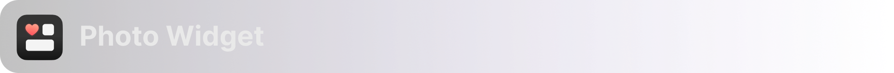

# Portfolio
👋🏻 Hi there, welcome to my _**portfolio**_ ✨!  
Get ready to dive into a mix of mind-blowing apps that I've _**crafted during my professional adventures**_ and some super intriguing _**side projects**_. So sit back, relax, and soak in all the awesomeness that's coming your way! Enjoy!
###### 🫶🏻 Just a friendly reminder, all text in blue is linked!

<!-- Agenda Start -->
## Agenda （ 6 apps + 2 side projects ）
### 👩🏻‍💻 Apps I Worked on：
###### 👇🏼Click on the name to view more detailed information below.

1.   [Meme Keyboard](#meme-keyboard)
  - Role: Creator & Idea Provider
  - [View on AppStore](https://apps.apple.com/tw/app/搜梗-meme梗圖鍵盤/id1611675156)
  - Technique：
    - Share Extension
    - Keyboard Extension
    - GCContext

2.   [Fasting Alarm](#fasting-alarm)
  - Role: Creator
  - [View on AppStore](https://apps.apple.com/tw/app/168斷食鬧鐘/id6444712791)
  - Technique: 
    - SwiftUI(Widget, Live Activity)
    - Unit Test

3.   [Knowledge King](#knowledge-king)
  - Role: Creator
  - [View on AppStore](https://apps.apple.com/cy/app/測測吧/id1641409607)
  - Technique: 
    - AVFoundation(Audio)
    - CAShapeLayer + CABasicAnimation

4.   [Photo Widget](#photo-widget)
  - Role: Contributor
  - [View on AppStore](https://apps.apple.com/th/app/咻拍-情侶-朋友-閨蜜必備的社交widget-app/id1606833799)
  - Technique: 
    - AVFoundation(Camera)

5.   [Pose Camera](#pose-camera)
  - Role: Creator
  - [View on AppStore](https://apps.apple.com/tw/app/必拍-姿勢照相機/id1606833478)
  - Technique: 
    - AVFoundation(Camera)
    - UIGesture
    - CIFilter 

6.  [God of Wealth](#god-of-wealth)
  - Role: Maintainer
  - [View on AppStore](https://apps.apple.com/tw/app/武財神-求好運免出門/id1477019338)
  - Technique:
    - GraphQL
    - Skeleton
  

### 👻 My Side Projects:
1.  [Accountant Rabbit](#accountant-rabbit)
  - [Demo Video](https://drive.google.com/file/d/1fRSM1woMzidByCOn2qTZEWiQyyJZ1HZU/view)
  - Technique：
    - JavaScript
    - Regular expressions
    - Google Apps Script
    - LINE APIs
  
2.  [Oral Keeping](#oral-keeping) <🏃🏻‍♀️in process...>
  - Technique：
    - Speech
    - SiriKit
    - Machine Learning Kit
<!-- Agenda End -->

## Detailed Information

<!-- 搜梗鍵盤 info start -->

- **Chinese name**: 搜梗鍵盤
- **Overview**: This App with a customized keyboard that transforms the way users engage with memes. This app enables seamless searching and sharing of funny meme images in any text field, instantly injecting humor into conversations. What sets it apart is the unique feature of incorporating friends' avatars into memes, fostering personalized and hilarious content that resonates with the younger audience. With this app, users can strengthen friendships through shared laughter and inside jokes.
- **Technique**:
  - **Share Extension**: This feature enables users to save memes conveniently by utilizing the share button wherever available.  
    ###### _View the demo GIF below or click [here](https://drive.google.com/file/d/1HQPY0VHSgzBQb1JxvpASPzspL0GLhdlD/view?usp=sharing) to watch the video on google drive._
    
    
  
  - **Keyboard Extension**: With this functionality, users can search the newest meme on the Meme Keboard instantly, and easily share them with friends through the copy and paste method.  
    ###### _View the demo GIF below or click [here](https://drive.google.com/file/d/1JEk9c8jBWplKtw-eUihhujrVEpYphwAY/view?usp=sharing) to watch the video on google drive._
  
    
  
  - **GCContext**: 
- [View on AppStore](https://apps.apple.com/tw/app/搜梗-meme梗圖鍵盤/id1611675156)

  <a href="#sogan-icon">⬆️ Back to Agenda</a>

<!-- 搜梗鍵盤 info end -->

  

<!-- 斷食鬧鐘 info start -->

- **Chinese name**: 斷食鬧鐘
- **Overview**: Introducing the Fasting Alarm Clock app for a healthy and disciplined lifestyle. Select your fasting mode, receive reminders, and track progress. Stay on track with alarms and an adorable penguin companion. Achieve your fasting goals effortlessly.
- **Technique**:
    - SwiftUI(Widget, Live Activity)
    - Unit Test
- [View on AppStore](https://apps.apple.com/tw/app/168斷食鬧鐘/id6444712791)

  <a href="#fasting-icon">⬆️ Back to Agenda</a>

<!-- 斷食鬧鐘 info end -->

  

<!-- 測測吧 info start -->

- **Chinese name**: 測測吧
- **Overview**: This is a knowledge-based trivia game app that gamifies the experience of challenging and competing against virtual opponents. Users can engage with various domains of knowledge while facing off against challenging "bosses." The app also allows users to create and share their own questions, enabling friendly competitions to determine who possesses the greatest expertise.
- **Technique**:
    - AVFoundation(Audio)
    - CAShapeLayer + CABasicAnimation
- [View on AppStore](https://apps.apple.com/cy/app/測測吧/id1641409607)

  <a href="#knowledge-king-icon">⬆️ Back to Agenda</a>

<!-- 測測吧 info end -->

  

<!-- 咻拍 info start -->

- **Chinese name**: 咻拍
- **Overview**: This app features a convenient home screen widget that displays the latest photos of your friends, ensuring you stay effortlessly connected with their updates. With this widget, you can effortlessly keep track of your friends' photo updates without the need to open the app. It provides a seamless and efficient way to stay in touch with your friends' visual journey, right from your device's home screen.
- **Technique**:
- [View on AppStore](https://apps.apple.com/th/app/咻拍-情侶-朋友-閨蜜必備的社交widget-app/id1606833799)

  <a href="#showpop-icon">⬆️ Back to Agenda</a>

<!-- 咻拍 info end -->

  

<!-- 必拍 info start -->

- **Chinese name**: 必拍
- **Overview**: Strike the perfect pose with our app! Say goodbye to awkwardness and hello to confidence. Our collection of perfect poses will have you capturing unforgettable moments with ease. Join our community of photography enthusiasts and let the fun begin!
- **Technique**:
    - AVFoundation(Camera)
    - UIGesture
    - CIFilter 
- [View on AppStore](https://apps.apple.com/tw/app/必拍-姿勢照相機/id1606833478)

  <a href="#pose-camera-icon">⬆️ Back to Agenda</a>

<!-- 必拍 info end -->

  
  
<!-- 武財神 info start -->

- **Chinese name**: 武財神 
- **Overview**: The app, GodOfWealth, aims to connect users with local temples and facilitate spiritual activities. Users can seek divine guidance through fortune-telling, virtually worship deities, make prayers, and access an lunar calendar. A portion of the proceeds from the app is donated to charitable organizations. Embrace the synergy of technology and spirituality for a convenient and meaningful divine connection.
- **Techniques**:
    - GraphQL
    - Skeleton
- [View on AppStore](https://apps.apple.com/tw/app/武財神-求好運免出門/id1477019338)

  <a href="#god-of-wealth-icon">⬆️ Back to Agenda</a>

<!-- 武財神 info end -->

  

<!-- This app had been suspended due to the heavy loading on server :(

- **Chinese name**: 租屋雷達
- **Overview**: "Rent Radar" is a rental property search engine designed specifically for tenants. It constantly scans major rental websites such as [591租屋網](https://www.591.com.tw), [樂屋網](https://www.rakuya.com.tw), and [好房網](https://www.housefun.com.tw), allowing you to find a place to rent with just one app. By setting your rental preferences as a radar, it will notify you of the latest available properties, offering a new experience of "passive house hunting."
- **Technique**:
- [View on AppStore](https://apps.apple.com/tw/app/租屋雷達-租房就是快-含fb社團-租屋網租屋/id1557423528)

  <a href="#rent-radar-icon">Back to Agenda</a>

 -->

<!-- 會計小兔 info start -->

- **Chinese name**: 會計小兔
- **Overview**: Accountant Rabbit, a LINE chatbot, records daily spending on Google Sheets via text input.
- **Inspiration**: 
I share an flat with a roommate, and we frequently go grocery shopping together and cook meals or dine out as a team. However, keeping track of our expenses and settling bills has become a hassle. Since we both use LINE as our primary messaging platform, I thought of leveraging its functionality to streamline the process. My idea is to develop a Line-based solution where we can instantly log our expenses after each purchase, and conveniently access our transaction history using Google Sheets. This way, we can effortlessly manage and track our shared expenses.
- [Demo Video](https://drive.google.com/file/d/1fRSM1woMzidByCOn2qTZEWiQyyJZ1HZU/view)
- **Technique**:
  - Language: JavaScript
  - Regular expressions: Filtered spending amounts using regular expressions and recorded remaining text as notes.
  - Platform: Google Apps Script
  - Webhook: Establish the connection between the LINE server and Google Sheets.

  <a href="#accountant-rabbit-icon">⬆️ Back to Agenda</a>

<!-- 會計小兔 info end -->

  

<!-- 口說記帳 info start -->

- **Chinese name**: 口說記帳
- **Overview**: 
Simply open your phone and describe your expenses to Siri. Through speech recognition, Siri converts your spoken words into text and uses AI to extract details such as time, location, itemized expenses, and amounts. All this information is seamlessly recorded in your phone, allowing for effortless expense tracking and budgeting.
- **Inspiration**: Managing personal finances has always been a struggle for me since I started earning money. Despite my best efforts, I have failed to establish a consistent habit of tracking my expenses. That's why I have made the decision to create a tool that eliminates any excuses for not keeping up with my finances. With this tool, I am determined to put an end to my previous failures in expense tracking.
- **Technique**:
    - Speech ✅
    - Siri Kit (working on...)
    - Apple Machine Learning Kit (working on...)

  <a href="#oral-keeping-icon">⬆️ Back to Agenda</a>

<!-- 口說記帳 info end -->

###### btw, these side project icons were designed by myself 💕

# Ending
#### 🎉 Congratulations on reaching the end of my portfolio ! Your persistence deserves a standing ovation.👏🏼 
If my portfolio managed to bring a smile to your face 😆, imagine the positive vibes I can bring to your team. Let's connect and discuss how we can create magic together 👉🼠[_Yang-blue?style=flat-square&logo=Linkedin&logoColor=white&link=https://www.linkedin.com/in/ria-chihyin-yang/)](https://www.linkedin.com/in/ria-chihyin-yang/)  

🙌🏼 Farewell for now, but not goodbye!

